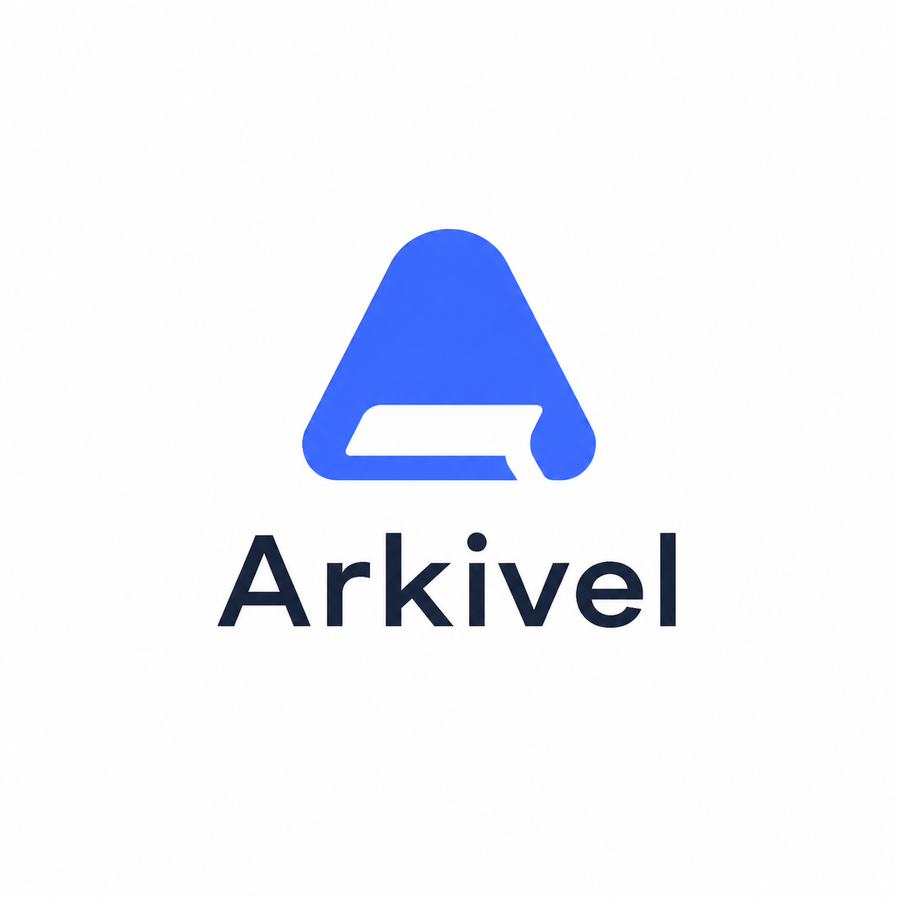

<p align="center">
  
</p>

<h1 align="center">Arkivel</h1>

<p align="center">
  <strong>Self-hosted wiki infrastructure for private knowledge, team handbooks, and worldbuilding canon.</strong>
</p>

<p align="center">
  <a href="https://vercel.com/new/clone?repository-url=https%3A%2F%2Fgithub.com%2Fmohammed-alsalhi%2Farkivel&env=DATABASE_URL,ADMIN_SECRET&envDescription=DATABASE_URL%3A%20PostgreSQL%20connection%20string.%20ADMIN_SECRET%3A%20Password%20for%20admin%20access.&project-name=arkivel">
    
  </a>
</p>

<p align="center">
  <a href="#run-locally"></a>
  <a href="#core-experiences"></a>
  <a href="#api-and-integrations"></a>
  <a href="#configuration"></a>
</p>

<p align="center">
  
  
  
  
  
  
</p>

## What Arkivel Is

Arkivel is a wiki application for people who need a real knowledge base, not a notes folder. It combines article writing, revision history, wiki links, roles, search, maps, feeds, public APIs, and AI-assisted reading/editing in one self-hosted Next.js app.

It is designed to feel like a working encyclopedia: dense, readable, serif-forward, and content-first. The newer flagship surfaces are still grounded in real wiki data, so they help readers move through the canon instead of becoming decorative dashboards.

## Core Experiences

| Experience | Route | What it does |
|---|---:|---|
| Article reader and editor | `/articles/[slug]` | Serif-first reading, wiki links, action rail, revisions, discussions, infoboxes, footnotes, tags, backlinks, and rich editing. |
| Arkivel Studio | `/studio` | Combines a live article canvas, database-style lanes, graph links, review pressure, and JSON Canvas export in one workspace. |
| Canon Trails | `/trails` | Builds guided reading routes from real article links, backlinks, categories, recency, depth, and engagement signals. |
| Canon Atlas | `/atlas` | Projects the wiki into territories, story threads, dossiers, continuity pressure, and next atlas moves. |
| Knowledge Cockpit | `/intelligence` | Runs 20 live quality, graph, canon, editorial, and audience engines with a constellation, radar, and impact simulator. |
| Article graph | `/graph` | D3 force graph of wiki links and semantic relations, with focused subgraphs. |
| Ask My Wiki | `/ask` | Streaming AI oracle grounded in wiki search and article sources. |
| API docs | `/api-docs` | Public REST API, operational feeds, sitemap, RSS, Atom, and integration references. |

## Feature Map

**Writing and editing**

- Tiptap rich text editor with a calm icon-first toolbar, Insert/Review/Outline feature trays, selection actions, contextual table controls, slash commands, Markdown mode, claim marking, syntax highlighting, collapsed-border tables, footnotes, images, captions, pull quotes, two-column blocks, accordions, vertical timelines, and auto-save.
- Wiki link autocomplete with `[[Article Name]]`, broken-link styling, backlinks, semantic relations, redirects, disambiguation pages, templates, custom metadata schemas, infoboxes, and automatic revision snapshots.
- AI assistance for rewriting, title/category/tag suggestions, outline building, grammar and style checks, alt text, section expansion, article generation, category synthesis, and revision summaries.

**Reading and discovery**

- Full-text search with relevance ranking, command palette navigation, random article, recent changes, Arkivel Studio, article graph, Canon Trails, Canon Atlas, Ask My Wiki, explore mode, saved searches, reading history, and sticky article headers.
- Reader tools include serif/sans/mono font preference, size and width controls, reading mode, focus mode, night mode, high contrast, text-only mode, speed reader, article quizzes, tutor mode, audio narration, and presentation mode.

**Governance and collaboration**

- Multi-user auth with viewer/editor/admin roles, legacy admin secret support, status workflow, review requests, claim-level review states, review due dates, verification stamps, edit suggestions, discussions, co-authors, locks, snapshots, restore, watchlists, notifications, and activity logs.

**Knowledge operations**

- Dashboards for wiki stats, health, content gaps, search analytics, category growth, writing velocity, referrers, retention, word counts, stubs, orphans, dead ends, duplicate content, long articles, cleanup tags, and maintenance/read-only mode.

**Publishing and integrations**

- RSS, Atom, public REST API, API keys, webhooks, sitemap, robots, MediaWiki import, Markdown/HTML/ZIP/JSON/CSV exports, Slack/Discord command hooks, embeds, PWA manifest, Vercel Blob uploads, and optional map layers.

## Run Locally

**Prerequisites**

- Node.js 18+
- PostgreSQL database, local or remote
- `DATABASE_URL` and `ADMIN_SECRET`

```bash
git clone https://github.com/mohammed-alsalhi/arkivel.git
cd arkivel
npm install
cp .env.example .env
```

Edit `.env`, then prepare the database and start the app:

```bash
npx prisma db push
node prisma/seed.mjs
npm run dev
```

Open [http://localhost:3000](http://localhost:3000). If `ADMIN_SECRET` is empty in local development, admin access is granted automatically.

## Deploy

### Vercel

1. Create a PostgreSQL database on [Neon](https://neon.tech), Supabase, or another hosted Postgres provider.
2. Click the Vercel button at the top of this README, or import the repository in Vercel.
3. Add `DATABASE_URL` and `ADMIN_SECRET`.
4. Deploy.

### Docker

```bash
docker compose up -d
```

Or build and run manually:

```bash
docker build -t arkivel .
docker run -p 3000:3000 --env-file .env arkivel
```

### Node.js

```bash
npm run build
npm start
```

Put the app behind Caddy, Nginx, or your platform's reverse proxy for TLS and custom domains.

## Configuration

A full template lives in [.env.example](.env.example). Only two variables are required.

| Variable | Required | Purpose |
|---|---:|---|
| `DATABASE_URL` | Yes | PostgreSQL connection string. |
| `ADMIN_SECRET` | Yes | Legacy admin password and local bootstrap secret. |
| `NEXT_PUBLIC_ARKIVEL_NAME` | No | Site name in shell, metadata, and manifest. |
| `NEXT_PUBLIC_ARKIVEL_TAGLINE` | No | Short tagline in the app chrome. |
| `NEXT_PUBLIC_ARKIVEL_DESCRIPTION` | No | SEO/social description. |
| `NEXT_PUBLIC_ARKIVEL_LOGO` | No | Full square logo, default `/brand/arkivel-logo.png`. |
| `NEXT_PUBLIC_ARKIVEL_LOGO_MARK` | No | Compact sidebar/mobile mark, default `/brand/arkivel-logo.svg`. |
| `NEXT_PUBLIC_ARKIVEL_APP_ICON` | No | Manifest/app icon, default `/brand/arkivel-icon-512.png`. |
| `NEXT_PUBLIC_MAP_ENABLED` | No | Set `true` to enable the interactive map. |
| `BLOB_READ_WRITE_TOKEN` | No | Vercel Blob token for image uploads. |

`NEXT_PUBLIC_*` values are baked into the build. Rebuild or redeploy after changing them.

## API And Integrations

| Surface | Route | Notes |
|---|---:|---|
| Public API | `/api/v1/*` | API-key protected article, category, search, and tag endpoints. |
| API documentation | `/api-docs` | In-app reference for endpoints, auth, and errors. |
| Studio feed | `/api/studio` | Generated command board, base views, graph links, and action queue. |
| Studio canvas export | `/api/studio/canvas` | JSON Canvas export for portable visual knowledge work. |
| Canon Trails feed | `/api/trails` | Guided route report for demos, readers, and automation. |
| Canon Atlas feed | `/api/atlas` | Territory, dossier, thread, continuity, and move report. |
| Knowledge feed | `/api/intelligence` | Cockpit score, engines, radar, graph, pressure model, and action queue. |
| RSS | `/feed.xml` | RSS 2.0 feed. |
| Atom | `/feed/atom` | Atom feed. |
| Webhooks | `/api/webhooks` | Article create/update/delete callbacks. |

## Architecture Snapshot

- **Framework:** Next.js 16 App Router, React 19, TypeScript
- **Data:** Prisma 7, PostgreSQL, `@prisma/adapter-pg`, Neon-compatible `pg` pool
- **Editor:** Tiptap 3 with wiki links, footnotes, tables, code highlighting, and custom blocks
- **Styling:** Tailwind CSS 4 with CSS variables in `src/app/globals.css`
- **Auth:** Legacy admin cookie plus multi-user sessions with viewer/editor/admin roles
- **Content model:** HTML article body, optional raw Markdown, revisions, categories, tags, translations, relations, discussions, watchlists, notifications, and operational metrics

See [ARCHITECTURE.md](ARCHITECTURE.md), [DESIGN.md](DESIGN.md), [ROADMAP.md](ROADMAP.md), [docs/features.md](docs/features.md), and [docs/help.md](docs/help.md) for the contributor-level references.

## Commands

```bash
npm run dev          # Start Next.js dev server
npm run build        # prisma db push + next build
npm run lint         # ESLint
npm run test         # Vitest
npm run test:e2e     # Playwright
npx prisma generate  # Regenerate Prisma client
npx prisma db push   # Push schema changes
node prisma/seed.mjs # Seed default categories
```

## License

MIT
